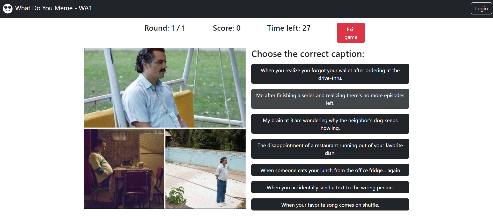
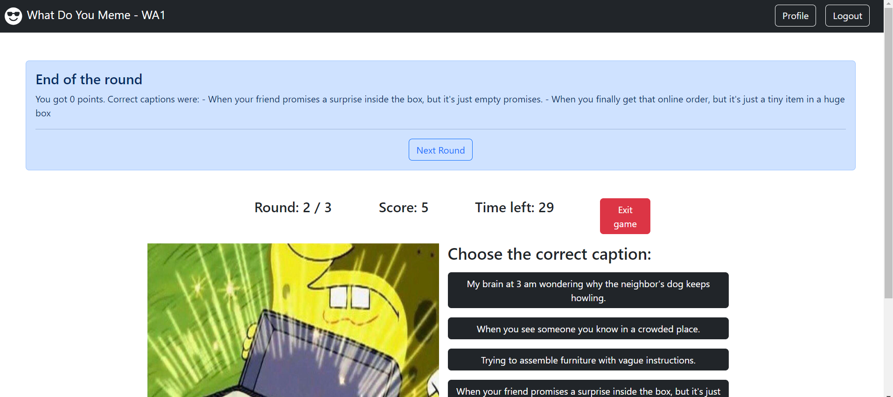

# Exam #1: "Meme Game"
## Student: s328914 FRANCIOS MASSIMO

## React Client Application Routes

- Route `/`: It's the home page of the application, it contains a button to start playing the game, and buttons to manage authentication
- Route `/game`: It's the main page, it contains the game itself, composed by a meme picture and seven captions, the user has to guess the correct caption for the meme
- Route `/profile`: It's the personal page of a user, it contains the user's information, including the history of all his completed games, and the total score among all games
- Route `/login`: It's the login page, it contains a form to perform login

## Main React Components

- `NavHeader` (in `NavBar.jsx`): It's the navigation bar of the application, it contains the link to the home page, the button to login (if the user is not logged in), the button to logout (if the user is logged in), and the button to go to the profile page (if the user is logged in)
- `GameComponent` (in `Game.jsx`): It's the main component of the game, it contains the meme picture and the seven captions, it also contains the logic to manage the game, the logic to navigate through rounds, and the logic to save a game
- `Stats` (in `Game.jsx`): It's a component that shows the statistics of a round, which are the number of the current round, the score of the game and the time left to complete a round. There is also a button to exit the game
- `CaptionComponent` (in `Game.jsx`): This component is used to display a caption, whenever a user clicks on a caption, the caption is sent to the server to check if it's the correct one
- `Profile` (in `Profile.jsx`): This component is used to display the user's information and a list of `GameHistoryComponent` components, which are used to display the history of the games played by the user
- `LoginForm` in `AuthComponent.jsx`: This component is used to display the login form, it contains the logic to perform the login

## API Server

- GET `/api/memes`: Fetches the list of all memes in the database
  - response body content: A JSON object representing the memes

- GET `/api/memes/random`: Fetches a random meme that has not been shown to the user in the current session.
  - request parameters: 
    - `pastMemes`: A comma-separated list of meme IDs that the user has already seen. This parameter is used to avoid repeating memes in the same session.
  - response body content: A JSON object representing the meme

- GET `/api/captions/:idMeme`: Fetches the seven captions for a given meme. The server makes sure that two of the captions are correct, and the other five are randomly selected from the database.
  - request parameters: 
    - `idMeme`: The ID of the meme for which to fetch the captions
  - response body content: A JSON object representing the captions

- GET `/api/memes/solution/:idMeme`: Fetches only the correct captions for a given meme
  - request parameters: 
    - `idMeme`: The ID of the meme for which to fetch the correct captions
  - response body content: A JSON object representing the correct captions

- POST `/api/memes/solution/:idMeme`: It validates a caption chosen by the user for a given meme
  - request parameters: 
    - `idMeme`: The ID of the meme for which to validate the caption
  - request body content: The ID of the caption chosen by the user
  - response body: a boolean value indicating if the caption is correct

- GET `/api/games/:idUser`: Fetches the history of the games played by a user
  - request parameters: 
    - `idUser`: The ID of the user for which to fetch the games
  - response body content: A JSON object representing the games

- POST `/api/games`: Saves a game played by a user
  - request body content: A JSON object representing the game
  - response body content: none

- POST `/api/sessions`: This endpoint is used to perform the login
  - request body content: A JSON object containing the username and password
  - response body content: A JSON object containing the user information

- GET `/api/sessions/current`: This endpoint is used to check if the user is logged in
  - response body content: A JSON object containing the user information

- DELETE `/api/sessions/current`: This endpoint is used to perform the logout
  - response body content: none
## Database Tables

- Table `meme` 
  - contains fields `idMeme` (primary key), `path` (string)
  - This table stores the id and the path of the memes
- Table `caption`
  - contains fields `idCaption` (primary key), `text` (string)
  - This table stores the id and the text of the captions
- Table `captionMeme`
  - contains fields `idMeme` (primary key), `idCaption` (primary key)
  - This table is used to keep track of the correct captions associated with a meme
- Table `game`
  - contains fields `idGame` (primary key), `userId`, `idMeme1`, `idMeme2`, `idMeme3`, `correct1`, `correct2`, `correct3`, `score`
  - This table stores information about the games played by the users, the "correct" fields are used to determine if the user has guessed the correct caption for the meme
- Table `user` 
  - contains fields `id` (primary key), `username` (string), `name` (string), `surname` (string), `password` (string), `salt` (string)
  - This table stores the information about the users

## Screenshots

## Users Credentials

- User1: 
  - username: `user1`, password: `user` (with games played)
- User2:
  - username: `user2`, password: `user`